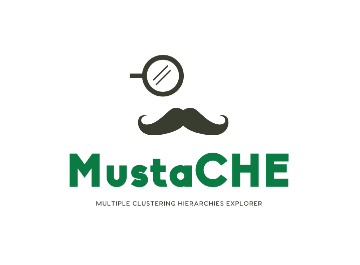

# MustaCHE v2

**MustaCHE** (Multiple Cluster Hierarchies Explorer) is a web-based tool for analyzing hierarchical density-based clustering using HDBSCAN algorithm with interactive visualizations.



## 🌟 Features

- **HDBSCAN Clustering**: State-of-the-art density-based clustering
- **Interactive Visualizations**:
  - Reachability Plot (cluster density visualization)
  - 2D Projection Map (t-SNE)
  - Hierarchical Dendrogram
- **Ground Truth Validation**: Upload known labels for ARI/AMI metrics
- **Multiple Distance Metrics**: Euclidean, Manhattan
- **Export Results**: Download analysis as JSON

## 🚀 Quick Start (Easiest Way)

### Prerequisites
- [Docker Desktop](https://www.docker.com/products/docker-desktop/) installed
- Git (optional, for cloning)

### Installation Steps

1. **Download MustaCHE**:
   ```bash
   git clone https://github.com/maylon-hub/mustache.git
   cd mustache
   ```
   
   *Or download as ZIP and extract*

2. **Start MustaCHE**:
   
   **Windows (PowerShell)**:
   ```powershell
   .\run.ps1
   ```
   
  or (in case of permission errors):

   ```powershell
   powershell -ExecutionPolicy Bypass -File .\run.ps1
   ```
  
   
   **Linux/Mac**:
   ```bash
   chmod +x run.sh
   ./run.sh
   ```

3. **Access** → Open browser at: **http://localhost:5001**

That's it! 🎉

## 🛠️ Manual Setup (Without Scripts)

If you prefer manual control:

```bash
# Build  and run with Docker Compose
docker compose up --build -d

# Access at http://localhost:5001

# Stop when done
docker compose down
```

## 📖 Usage Guide

### 1. Upload Dataset
- Click "Choose File" under **Dataset (CSV)**
- Select a CSV file with numerical features (no headers)
- Example format:
  ```
  1.2,3.4,5.6
  2.1,4.3,6.5
  ...
  ```

### 2. (Optional) Upload Ground Truth Labels
- Click "Choose File" under **Ground Truth Labels**
- Upload CSV file with one label per line
- This enables validation metrics (ARI, AMI)

### 3. Configure Parameters
- **Min Cluster Size**: Minimum points to form a cluster (default: 5)
- **Min Samples**: Neighborhood size (default: 5)
- **Distance Metric**: Choose Euclidean or Manhattan

### 4. Run Analysis
- Click **"Run Clustering"**
- Wait for processing (usually < 5 seconds)
- Explore interactive visualizations!

### 5. Export Results
- Click **"Export JSON"** to download full analysis
- Includes parameters, labels, metrics, and plot data

## 📁 Project Structure

```
mustache/
├── app/                    # Flask application
│   ├── static/
│   │   ├── css/           # Stylesheets
│   │   ├── js/            # JavaScript
│   │   └── img/           # Logos and images
│   ├── templates/          # HTML templates
│   ├── core.py            # Clustering logic
│   └── routes.py          # API endpoints
├── datasets/              # Sample datasets
├── legacy/                # Original codebase (archived)
├── Dockerfile             # Docker configuration
├── docker-compose.yml     # Multi-container setup
├── requirements.txt       # Python dependencies
├── run.py                 # Flask entry point
├── run.ps1               # Windows startup script
└── run.sh                # Linux/Mac startup script
```

## 🔧 Advanced Configuration

### Port Configuration
Change the port in `docker-compose.yml`:
```yaml
ports:
  - "YOUR_PORT:5000"
```

### Python Dependencies
Edit `requirements.txt` and rebuild:
```bash
docker compose up --build -d
```

## 🐛 Troubleshooting

### Port Already in Use
```bash
# Stop existing container
docker compose down

# Or change port in docker-compose.yml
```

### Docker Not Running
Make sure Docker Desktop is open and running.

### File Upload Errors
- Ensure CSV files are properly formatted
- Check that numerical data has no headers
- Verify file encoding is UTF-8

### Container Rebuild
If changes don't appear:
```bash
docker compose down
docker compose up --build -d --force-recreate
```

## 📊 Sample Data

Try the included sample dataset:
- **Dataset**: `datasets/sample_data.csv` (11 points, 2D)
- **Labels**: `datasets/sample_labels.csv` (3 clusters)

## 🤝 Contributing

Contributions welcome! Please:
1. Fork the repository
2. Create a feature branch
3. Make your changes
4. Submit a pull request

## 📝 Credits

**Original Concept**: Antonio Cavalcante and others (2017)

**Institutions**:
- Federal University of São Carlos (UFSCar)
- Newcastle University
- James Cook University

**Rebuilt by**: Maylon Martins de Melo (2025)

## 📄 License

[Add your license here]

## 🆘 Support

For issues and questions:
- Open an issue on GitHub
- Check the [troubleshooting section](#-troubleshooting)

---

**Version**: 2.0  
**Tech Stack**: Flask + Python 3.11 + scikit-learn + Plotly.js + Docker
