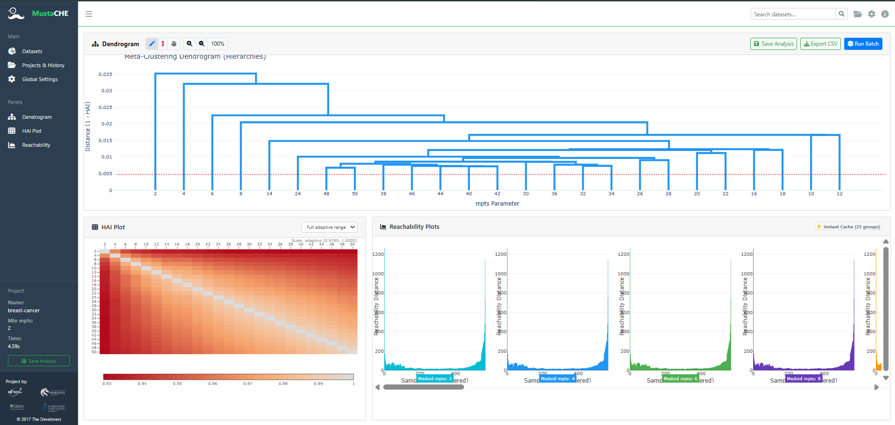

---
hide:
  - toc
---

# MustaCHE

Explore múltiplas hierarquias de agrupamento baseadas em densidade, compare a estabilidade entre parâmetros e preserve as decisões de análise.

[Começar pelo guia](guia_documentacao.md){ .md-button .md-button--primary }
[Abrir no GitHub](https://github.com/Maylon-hub/mustache){ .md-button }

{ .hero-shot }

## Fluxo de exploração

-   :material:database-search: __Escolha os dados__

    Use um conjunto de exemplo reprodutível ou envie um CSV com colunas numéricas.

-   :material:chart-timeline-variant: __Execute um lote__

    Varra uma faixa de valores de `mpts` para construir hierarquias, HAI e gráficos de acessibilidade.

-   :material:source-branch: __Selecione estruturas relevantes__

    Clique em um ramo azul do meta-dendrograma para selecionar todas as hierarquias sob ele.

-   :material:content-save-outline: __Salve e exporte__

    Preserve a análise no histórico local ou exporte CSVs com rótulos e probabilidades.

## Formas de usar

| Contexto | Caminho recomendado |
| --- | --- |
| Exploração visual | Inicie a interface com `mustache` e abra `http://127.0.0.1:5000`. |
| Script Python | Importe `run_clustering` ou `run_batch_clustering`. |
| Notebook | Execute o [quickstart](https://github.com/Maylon-hub/mustache/blob/mustache-core-sg/examples/mustache_quickstart.ipynb). |
| Avaliação reprodutível | Use ambiente virtual, versões fixadas e o roteiro do guia. |

!!! tip "Primeira análise"
    Comece pelo Iris ou Four Blobs, execute um lote curto e experimente clicar nos ramos do dendrograma antes de trabalhar com um CSV próprio.

## Componentes principais

- **Core-SG:** reutiliza um grafo de suporte para extrair múltiplas MSTs de forma eficiente.
- **HAI:** mostra o acordo entre hierarquias e ajuda a identificar transições estruturais.
- **Meta-dendrograma:** agrupa configurações semelhantes de `mpts` em uma visualização navegável.
- **Reachability plots:** revelam vales de densidade e suportam a interpretação das partições.
